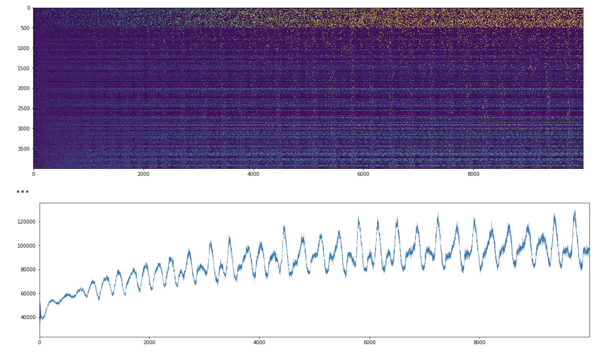

This repository contains experiments in digital spiking neural networks.

The work is inspired by the [Simple Model of Spiking Neurons](https://www.izhikevich.org/publications/spikes.htm) by Eugene M. Izhikevich. However, we are attempting to build something that has a greater hardware-affinity while retaining the important properties of the spiking networks.

